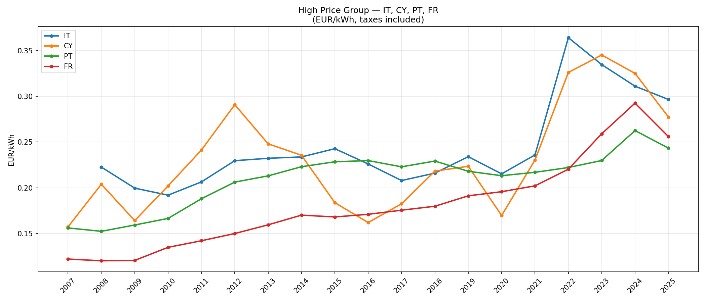
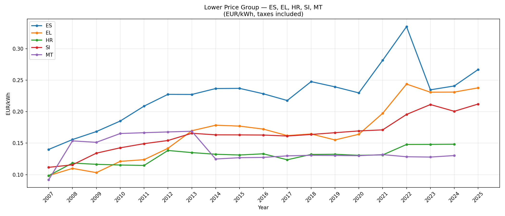

# eu-energy-price-analysis

# EU Electricity Price Analysis

Analysis of household electricity prices across Mediterranean 
EU countries from 2007 to 2025, using official Eurostat data.

## Objective
Compare electricity price trends across Mediterranean EU 
countries to identify patterns, divergences, and the impact 
of the 2022 energy crisis.

## Data Source
- **Dataset:** Eurostat NRG_PC_204
- **Download:** [ec.europa.eu/eurostat](https://ec.europa.eu/eurostat/databrowser/view/NRG_PC_204)
- **Unit:** EUR/kWh, taxes included, medium consumption band

## Countries Analysed
| Group | Countries |
|---|---|
| High price | Italy, Cyprus, Portugal, France |
| Lower price | Spain, Greece, Croatia, Slovenia, Malta |

## Technical Implementation
- Python 3.12, Pandas, Matplotlib, Jupyter Notebook
- Raw data ingestion from compressed TSV format (.tsv.gz)
- Data wrangling: composite index split, numeric conversion,
  NaN handling
- Annual resampling (S2) for trend visualization
- Two-panel grouped visualization by 2024 price level

## Key Findings
- Sharp price spike in 2022 visible across all countries
- Italy and Cyprus consistently above Mediterranean average
- Croatia and Malta historically lowest prices
- France shows sustained growth from 2020 onwards
- General downward correction in 2023-2024 after peak

## Charts



## How to Run
```bash
jupyter notebook analysis.ipynb
```

## Author
[github.com/melmaur](https://github.com/melmaur)
